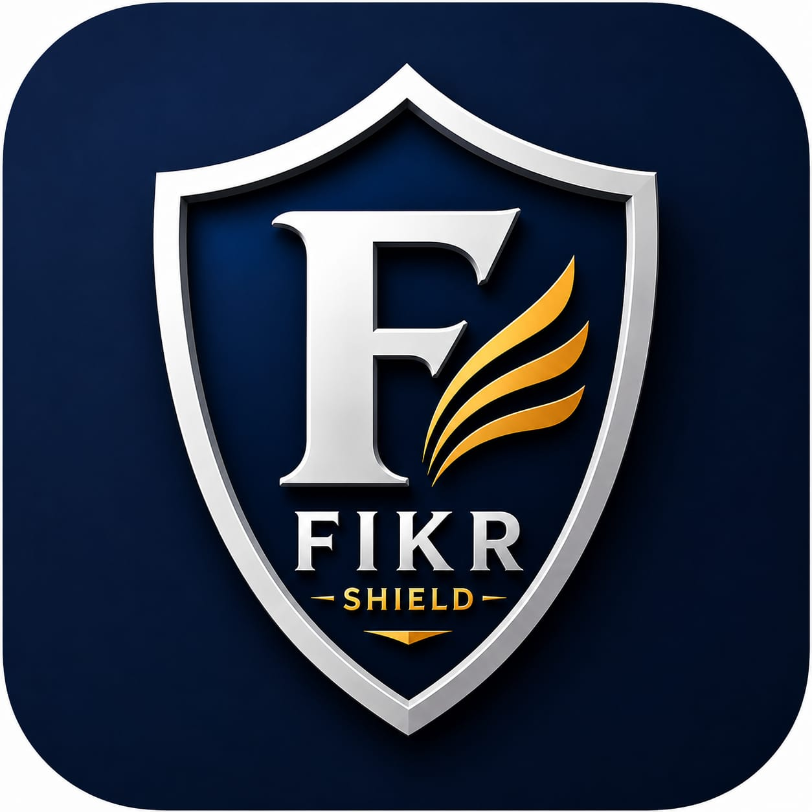

# 🛡️ Fikr Shield - Self Discipline & Accountability PWA

**"Fikr" (فکر) means "concern/awareness" — Your daily shield against distractions.**

---

## 📖 About

**Fikr Shield** is a Progressive Web App designed to help you build self-discipline by tracking daily commitments to avoid time-wasting activities. Inspired by the Islamic concept of *Jihad al-Nafs* (struggle against the self), this app transforms your daily victories into charitable actions (Sadaqah).

### 🎯 The Problem
- Time-wasting activities drain productivity and spiritual energy
- Lack of accountability makes it hard to stay consistent
- No tangible reward system for self-discipline

### 💡 The Solution
- **Daily Shield Activation**: One-click commitment tracking
- **Visual Calendar**: See your entire year's progress at a glance
- **Smart Notifications**: Timely reminders before vulnerable moments
- **Sadaqah Rewards**: Monthly completion unlocks charity suggestions
- **Mood Tracking**: Understand emotional patterns
- **Reflection Journal**: Document your journey

---

## ✨ Features

### 🛡️ Core Features
| Feature | Description |
|---------|-------------|
| 📅 **Year Calendar** | 12-month navigable calendar with day boxes |
| ✅ **One-Click Shield** | Tap any day to mark as protected |
| 🔥 **Streak Tracking** | Consecutive day counter with milestones |
| 📊 **Progress Bar** | Monthly completion visualization |
| 🎁 **Sadaqah Rewards** | 12 unique charity suggestions with Quran verses |
| 📝 **Reflection Journal** | Optional daily journal entries |
| 😊 **Mood Tracking** | 8 mood options with encouragement messages |

### 🔔 Notification System
| Time | Notification | Purpose |
|------|-------------|---------|
| 🌅 Morning (6 AM) | Morning Motivation | Start day with intention |
| 🌙 Evening (9 PM) | Shield Reminder | Activate before night |
| 🌃 Night (11 PM) | Protection Alert | Late night reminder |
| ⚠️ 10:30 PM | Missed Day Warning | Don't break your streak |

### 🎯 Challenge System
- **7-Day Challenge**: Build initial momentum
- **15-Day Challenge**: Half-month milestone
- **30-Day Challenge**: Full month mastery
- **90-Day Challenge**: Quarter year of discipline

### 📊 Analytics & Stats
- Total protected days
- Monthly completion rate
- Yearly success percentage
- Longest streak record
- Reflections count
- Rewards earned

### 🎨 Customization
- Adjustable notification times
- Toggle individual reminders
- Enable/disable reflection prompts
- Dark theme optimized

---

## 🚀 Live Demo

**Visit:** [https://muhammadtalha-de.github.io/fikr-shield/](https://muhammadtalha-de.github.io/fikr-shield/)

### 📱 Install as PWA
1. Open the link in Chrome/Safari on your phone
2. Tap "Add to Home Screen"
3. Use it like a native app — works offline!

---

## 🛠️ Technology Stack

| Technology | Usage |
|------------|-------|
| **HTML5** | Semantic structure |
| **CSS3** | Custom properties, animations, responsive design |
| **Vanilla JavaScript (ES6+)** | All application logic |
| **Service Worker** | Offline support, caching, push notifications |
| **Web App Manifest** | PWA installation |
| **LocalStorage** | Data persistence |
| **Notification API** | Push reminders |
| **GitHub Pages** | Free hosting & deployment |

---

## 📁 Project Structure
